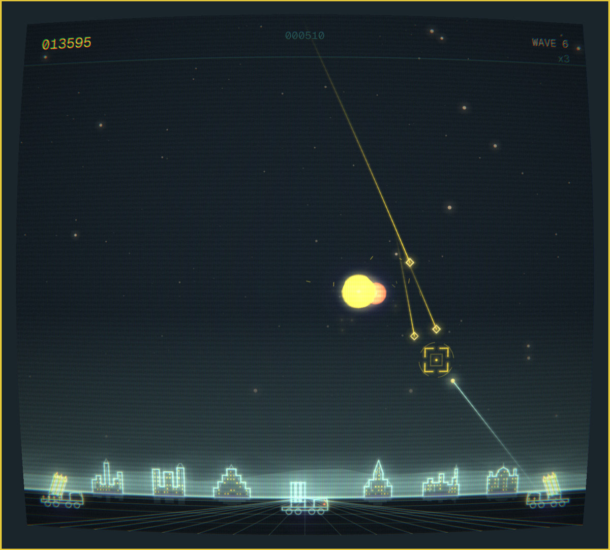
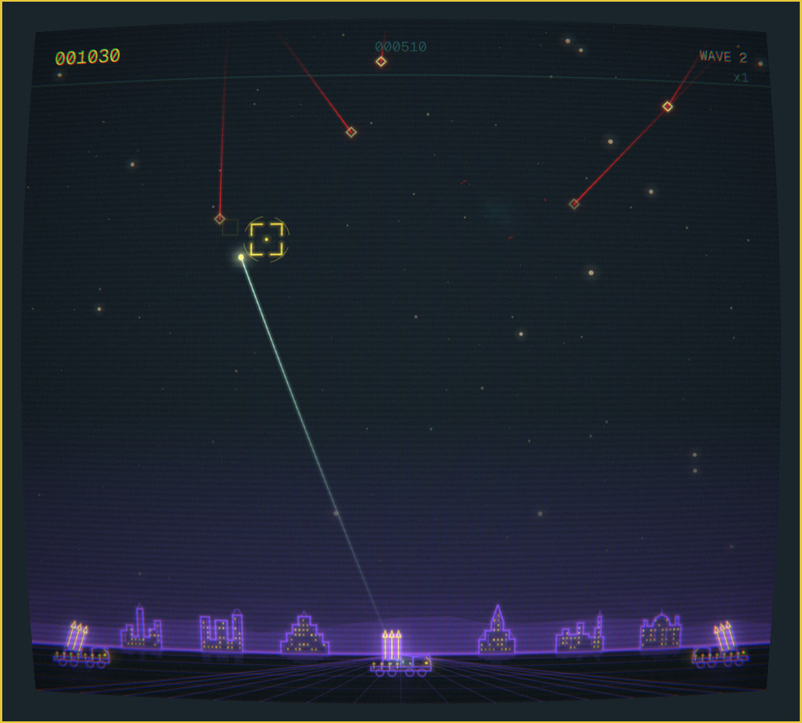
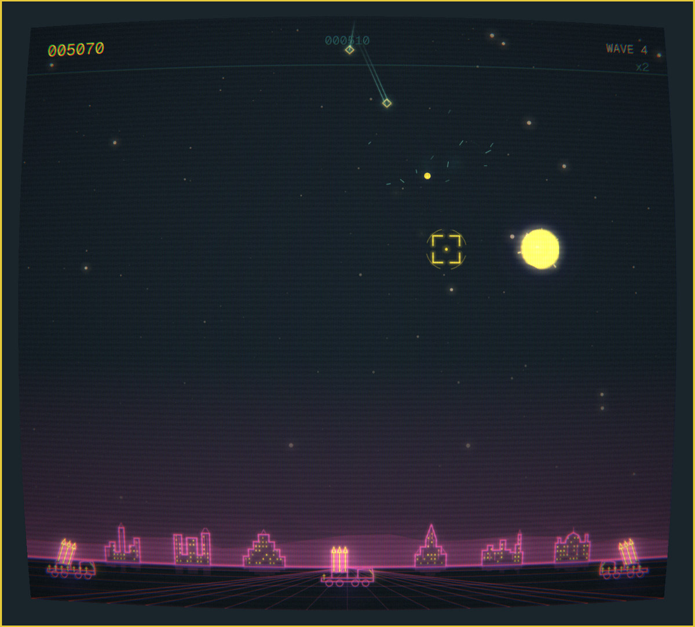
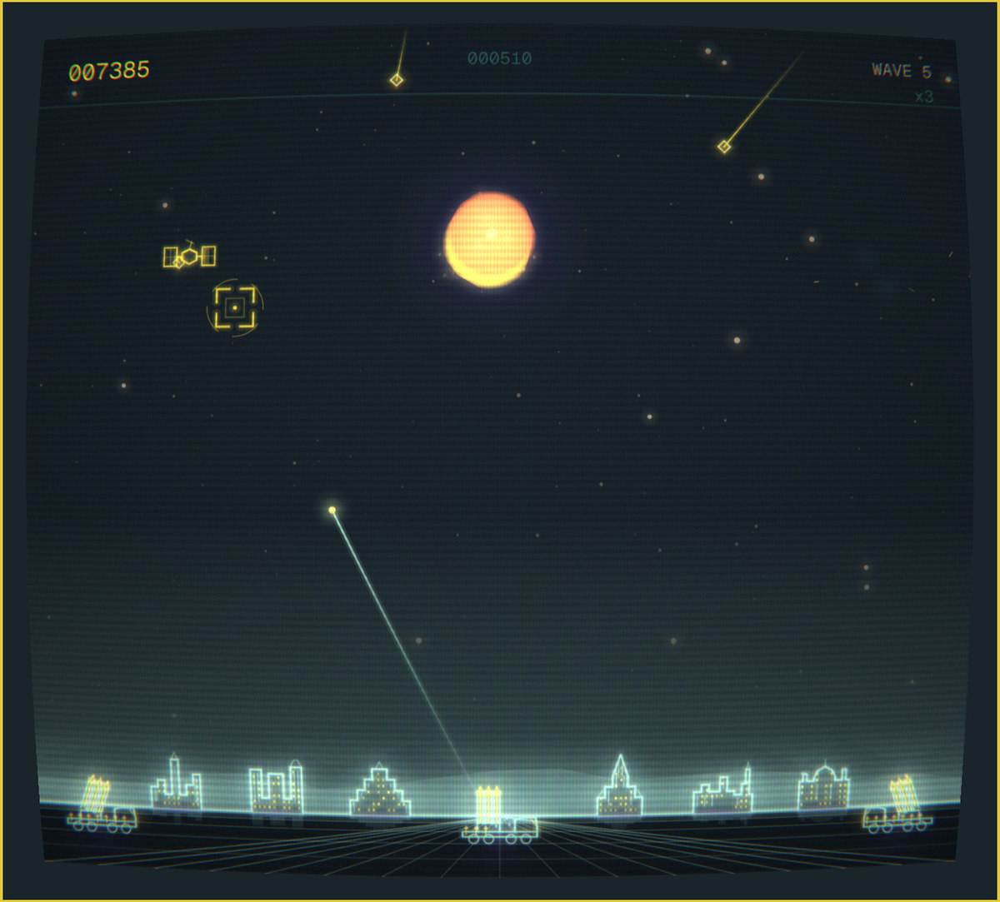
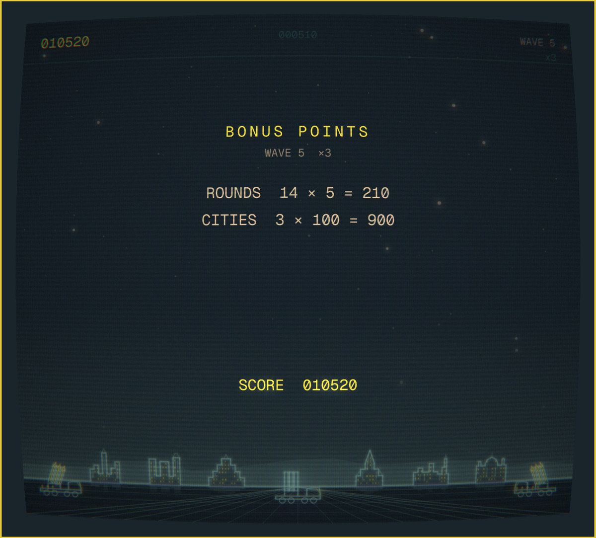

# Quattro Command

Missile defence as a native Omarchy shell plugin. Six cities and three
launchers under a night sky, drawn as glowing vectors on a curved phosphor
screen — in your live theme, so it recolours the moment your desktop does.



- Warheads fall on your cities; you have thirty rounds a wave and eight
  interceptors in the air at once
- From wave three they **split into three** on the way down, and from wave five
  some of them **steer around your explosions**
- Bombers, satellites and killer satellites cross overhead from waves two, four
  and eight
- Explosions carry no outline, so overlapping ones **merge into one wall of
  fire** — chaining them is where the scores are
- Three cities can fall per wave, and every 10,000 points buys one back
- The palette **rotates every two waves**, so wave nine never looks like wave one
- High scores with three-letter initials, kept between sessions

## Install

```bash
omarchy plugin add https://github.com/28allday/Quattro-Command --enable
```

Or with the installer, which does the same thing and places the bar icon:

```bash
./install.sh
```

Then click the  in the bar, or bind a key to:

```bash
omarchy-shell shell toggle nosignal.quattro-command
```

`install.sh` takes two optional overrides: `QCOMMAND_SECTION` picks the bar
section (`left`, `center` or `right`, default `right`), and `QCOMMAND_REPO`
registers the plugin from a fork instead.

## Removal

```bash
omarchy plugin remove nosignal.quattro-command
```

That unregisters the plugin and drops its bar icon. High scores are left
behind; delete those too with:

```bash
rm -rf ~/.local/state/omarchy-quattro-command
```

## Playing

| Input | Action |
| --- | --- |
| **Mouse** | Aim |
| **Left click** | Fire from whichever launcher is best placed |
| **Right click** | Fire from Kilo specifically |
| **A** / **S** / **D** | Fire from Bravo, Kilo or Sierra by name |
| **1** / **2** / **3** | The same three |
| **Enter** | Start, and dismiss the end screens |
| **F1** | Curved-screen effect on or off |
| **M** | Mute |
| **Escape** | Close the cabinet |

Kilo, in the centre, flies three times faster than the other two — it is the
one you want when something is already low. Bravo and Sierra are slower but
they sit out at the edges, and a warhead falling on the far right is not Kilo's
problem to solve.

Watch what you spend. Unused rounds are worth points at the end of every wave,
multiplied by the wave multiplier shown under the wave number, so a wave
cleared with rounds to spare pays considerably better than one you sprayed.

A fireball holds full size for half a second. That is long enough for the next
warhead to fly into it, which is the whole game: aim where something *will* be,
not where it is.

## The waves

| Wave | What arrives |
| --- | --- |
| 1 | Warheads |
| 2 | Bombers |
| 3 | MIRVs — one warhead that becomes three. They fly on twin exhausts until they split, which is your only warning |
| 4 | Satellites |
| 5 | Smart bombs — they steer away from your fireballs |
| 8 | Killer satellites |

Warheads get faster and more numerous every wave, and stop getting worse at
wave 19.

## Scoring

| Target | Points |
| --- | --- |
| Warhead | 25 |
| Smart bomb | 125 |
| Bomber | 100 |
| Satellite | 100 |
| Killer satellite | 150 |
| Unused round, at the end of a wave | 5 |
| Surviving city, at the end of a wave | 100 |

Everything is multiplied: ×1 for waves 1–2, ×2 for 3–4, and so on to ×6 from
wave 11.

| | |
| --- | --- |
|  |  |
|  |  |

## Dependencies

Omarchy 4 and its shell. Two optional extras:

- **`qt6-multimedia`** for sound. Omarchy does not install it by default and the
  game plays perfectly well without it — it just plays silently.
  `sudo pacman -S qt6-multimedia`
- **`jq`**, which Omarchy already installs, for one piece of plumbing described
  below.

Nothing is fetched or built at install time. The ten sounds ship as WAVs and
the three shaders ship pre-compiled.

## What it writes, and what it does not

- `~/.local/state/omarchy-quattro-command/state.json` — the high score table,
  the mute setting and whether the curved screen is on. Written when one of
  those changes.
- `~/.config/omarchy/shell.json` — **on first open**, the plugin appends its own
  `{"id": "nosignal.quattro-command"}` entry to `plugins[]` if one is not
  already there, using `jq`. This is a workaround: `omarchy plugin enable`
  writes only the bar-layout entry for a plugin that is both a panel and a bar
  widget, so without that entry the keybinding stops working the moment the bar
  icon is removed. The edit is idempotent, appends only, changes no other
  setting, and goes away once upstream
  [PR #6510](https://github.com/basecamp/omarchy/pull/6510) lands. The code is
  near the top of `Panel.qml` if you would rather read it than take my word.

Nothing else on the system is touched. The plugin makes **no network
requests**, needs no credentials, runs nothing privileged, and starts no
process beyond the `jq` edit above and a `mkdir -p` for its own state
directory.

## Theme

Colours come from the shell, live. Switching desktop theme recolours the game
mid-wave, and the game's own rotation moves the mapping on every second wave,
so the cities, the sky and the trails all shift as you go. The screenshots
above are one theme, across waves two, four, five and six.

The curved screen — barrel distortion, scanlines, an aperture-grille mask and a
vignette — is on by default. **F1** switches it off if you would rather have
the flat, sharper picture.

## Where things live

| Path | What |
| --- | --- |
| `manifest.json` | Plugin manifest — `panel` + `bar-widget`, `keepLoaded` |
| `Panel.qml` | The cabinet: window, focus, theme, high scores on disk |
| `game/` | The game itself, with no dependency on the shell |
| `shaders/` | Bloom and curved-screen shaders, source and compiled |
| `audio/` | Ten synthesised sounds, plus the script that renders them |
| `~/.local/state/omarchy-quattro-command/state.json` | High scores and settings |

## Originality

This is a missile-defence game, and it is not the first one. What it owes to
the genre are its rules — defend cities, three launchers, warheads that split,
explosions that chain — and rules are not anyone's property.

Everything you can see or hear is this project's own. The city outlines and the
launchers were drawn by hand in the game's own coordinate space, the sky and
the starfield are generated at runtime, the ten sounds are synthesised by
`audio/make_sounds.py`, and the three shaders were written for this. No code,
art, audio or text has been taken from any commercial game, and there is no
affiliation with, or endorsement by, any game publisher.

## Licence

MIT.
