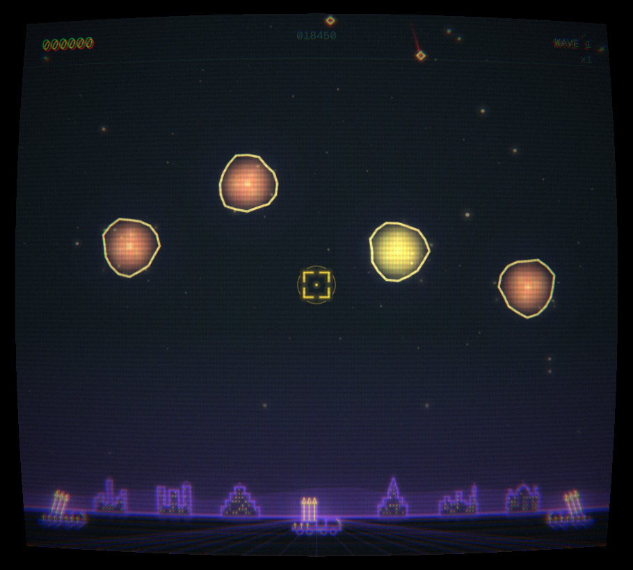
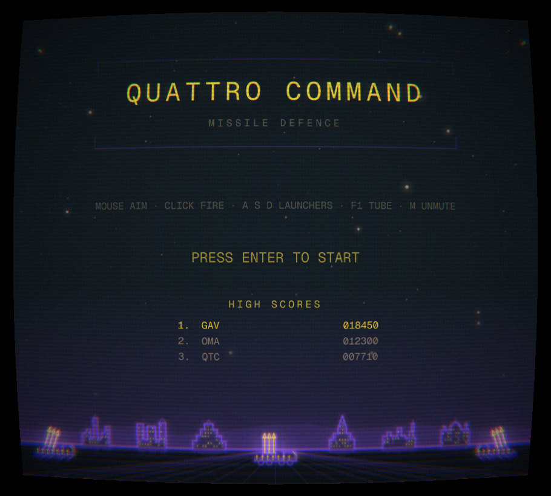
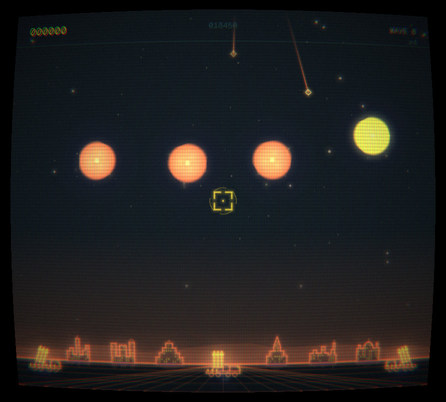
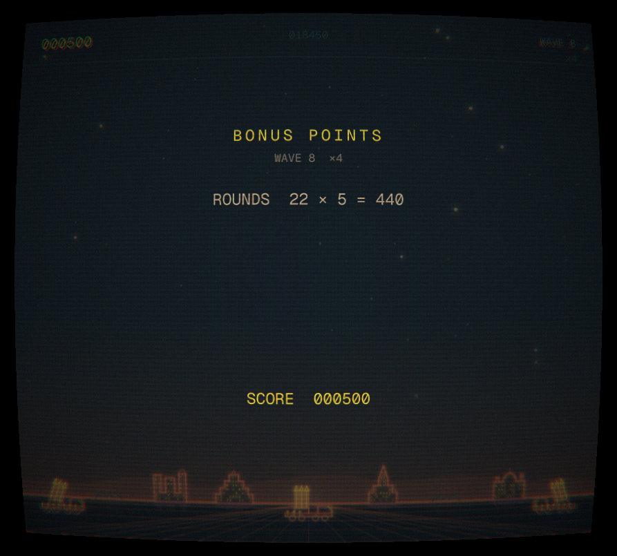
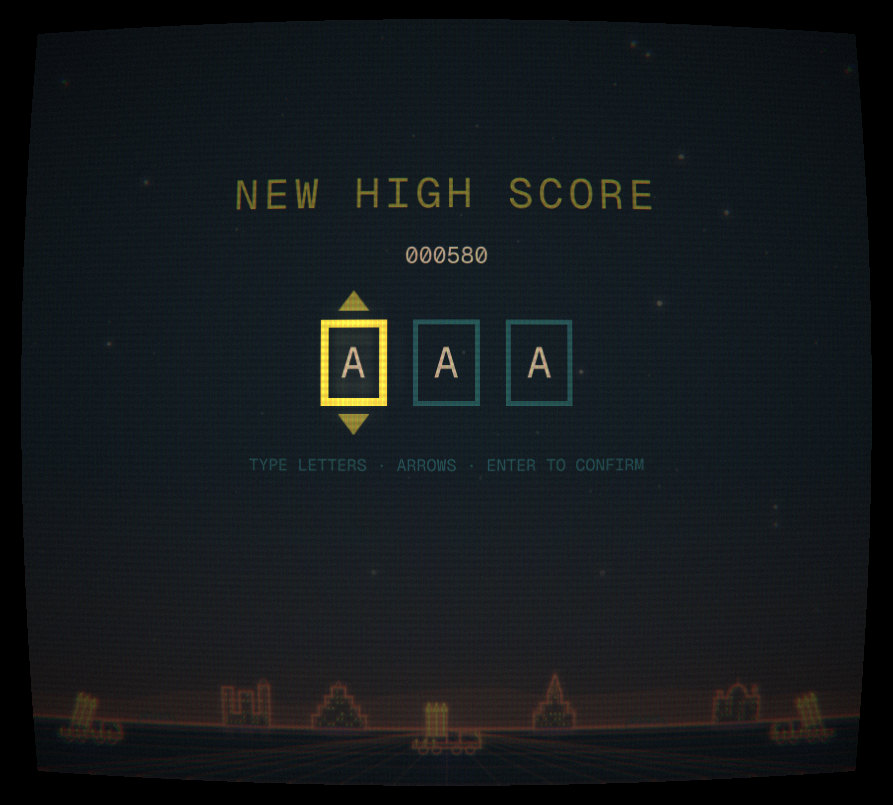
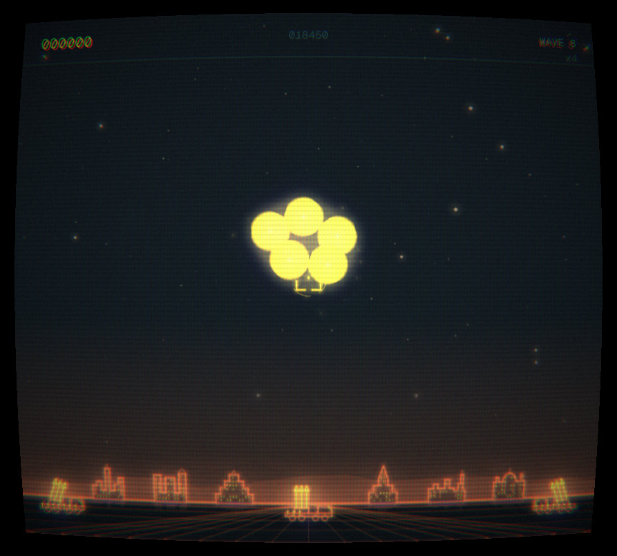
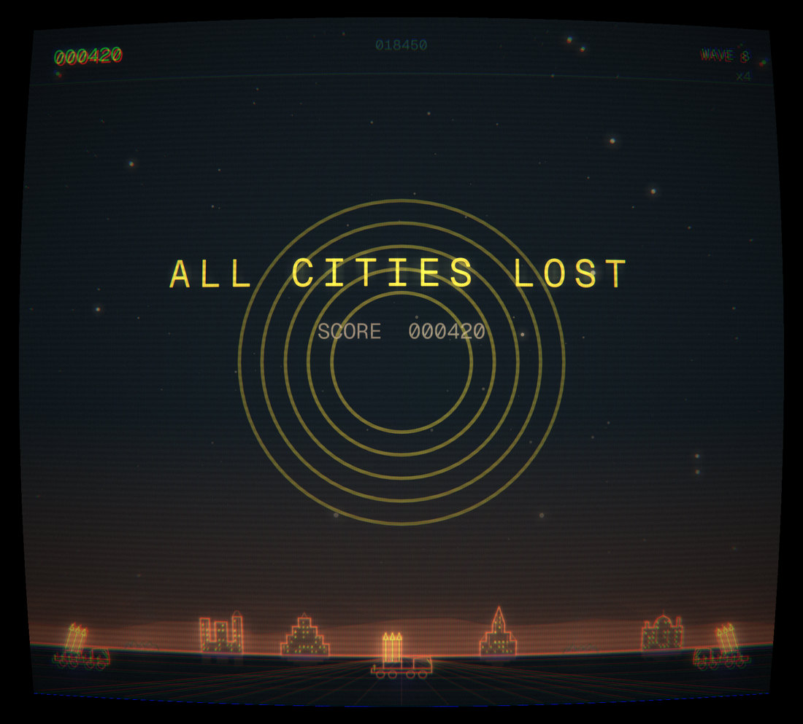

# Quattro Command

A vector missile-defence cabinet for the [Omarchy](https://omarchy.org) shell.

Six cities and three launchers under a night sky. Warheads come down; some of
them split into three on the way, and from wave five some of them steer around
your explosions. You have thirty rounds a wave and eight interceptors in the
air at once. Three cities can fall per wave. Every ten thousand points buys one
back.

It is drawn as glowing vectors on a curved phosphor screen, in your live
Omarchy theme — switch theme and the game recolours mid-wave, and the palette
rotates on its own every two waves, so wave nine does not look like wave one.



## Install

```bash
omarchy plugin add https://github.com/28allday/Quattro-Command
```

Then click the crosshair in the bar, or bind a key to:

```
omarchy-shell shell toggle nosignal.quattro-command
```

`./install.sh` from a clone does the same thing and places the bar icon for you.

Sound needs `qt6-multimedia`, which Omarchy does not install by default. The
game runs fine without it; it just runs silent.

```bash
sudo pacman -S qt6-multimedia
```

## Playing

| Input | Action |
|-------|--------|
| **Mouse** | Aim |
| **Left click** | Fire from the best-placed launcher |
| **Right click** | Fire from Kilo specifically |
| **A** / **1** | Fire from Bravo (left) |
| **S** / **2** | Fire from Kilo (centre, three times faster) |
| **D** / **3** | Fire from Sierra (right) |
| **Enter** | Start, and dismiss the end screens |
| **F1** | Curved-screen effect on or off |
| **M** | Mute |
| **Escape** | Close the cabinet |

Kilo is the fast one and it is the one you will want when something is already
low. Bravo and Sierra are slower but they are closer to the edges, and a warhead
falling on city six is not Kilo's problem to solve.

Chain your explosions. A fireball stays at full size for half a second, which is
long enough to catch the next warhead through it — that is where the scores are.
Fireballs carry no outline, so overlapping ones merge into a single wall of
fire, and a well-placed chain closes off a whole corner of the sky.

## Scoring

| Target | Points |
|--------|--------|
| Warhead | 25 |
| Smart bomb | 125 |
| Bomber | 100 |
| Satellite | 100 |
| Killer satellite | 150 |
| Unused round, at the end of a wave | 5 |
| Surviving city, at the end of a wave | 100 |

Everything is multiplied by the wave multiplier: ×1 for waves 1–2, ×2 for 3–4,
and so on up to ×6 from wave 11. The multiplier is shown under the wave number
while you play, so you can decide whether a round is worth spending.

## What turns up when

| Wave | New |
|------|-----|
| 2 | Bombers |
| 3 | MIRVs — warheads that split into two or three. They fly on twin exhausts before they split, which is your only warning |
| 4 | Satellites |
| 5 | Smart bombs — they steer away from your fireballs |
| 8 | Killer satellites |

## Screens

| | |
|---|---|
|  |  |
|  |  |
|  |  |

## Where things are kept

High scores, the mute setting and the screen setting live in
`~/.local/state/omarchy-quattro-command/state.json`.

## Requirements

- Omarchy 4
- `qt6-multimedia`, for sound only

## Originality

This is a missile-defence game, and it is not the first one. What it owes to the
genre are its rules — defend cities, three launchers, warheads that split,
explosions that chain — and rules are not anyone's property.

Everything you can see or hear is this project's own. The city outlines and the
launcher were drawn by hand in the game's own coordinate space, the sky and the
starfield are generated at runtime, the ten sounds are synthesised by
`audio/make_sounds.py`, and the three shaders were written for this. No code,
art, audio or text has been taken from any commercial game, and there is no
affiliation with, or endorsement by, any game publisher.

## License

MIT
